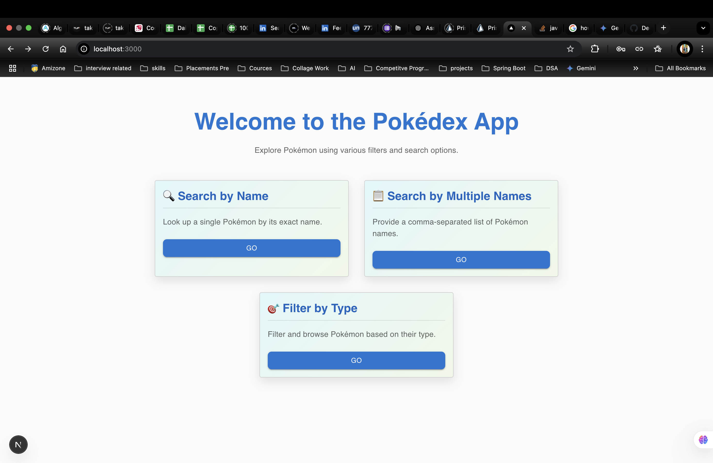
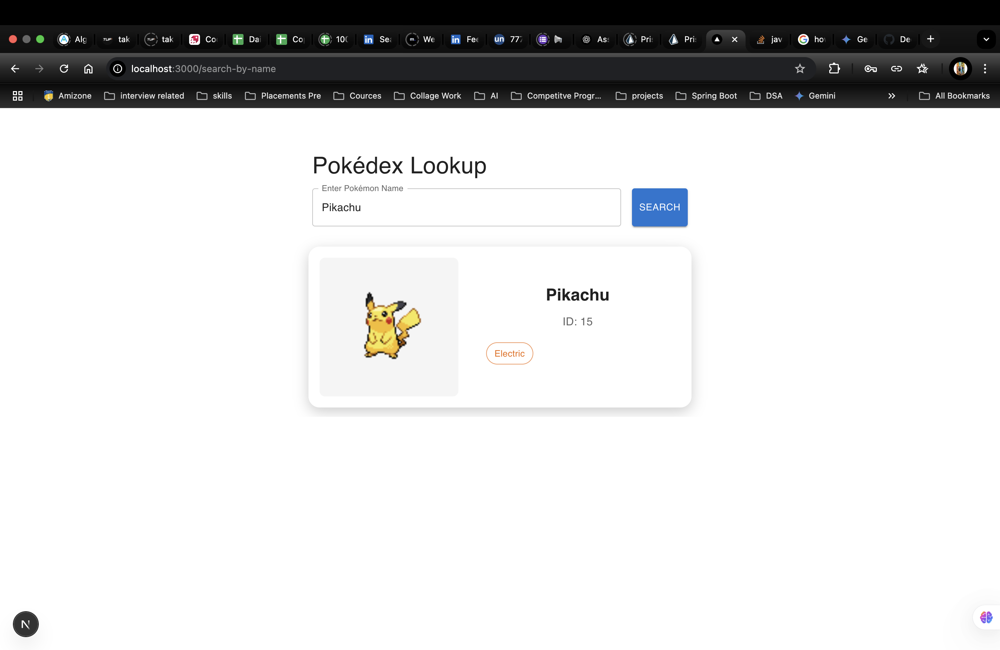
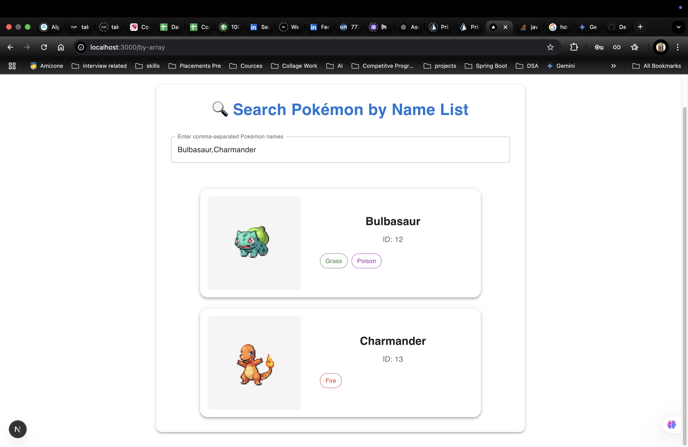

# Pokédex tRPC App 🧢

A full-stack Pokédex application built with **TypeScript**, **Next.js App Router**, **Prisma + PostgreSQL**, **tRPC**, and **Material UI**. Search Pokémon by name, list multiple Pokémon, or filter them by type — all with beautiful UI and smooth animations!






---

## 🔥 Features

- 🔍 Search Pokémon by exact name
- 📋 Display multiple Pokémon by name array
- 🎯 Filter Pokémon by type
- 🌈 Responsive, modern UI with animations
- 📦 Prisma + SQL schema (PostgreSQL)
- ⚡ Fast API calls using `tRPC`
- 🎨 Built with Material UI & TypeScript

---

## 🛠️ Tech Stack

- **Frontend:** Next.js 14 (App Router), React, TypeScript, MUI
- **Backend:** tRPC, Prisma ORM
- **Database:** PostgreSQL (e.g., PlanetScale or Supabase)
- **Styling:** Material UI with responsive layouts
- **Hosting:** Vercel (frontend) + PlanetScale/Supabase (DB)

---

## 📂 Project Structure

```bash
src/
├── app/                   # Pages and routing
├── components/            # Reusable UI components
├── lib/                   # tRPC client setup
├── server/
│   ├── db.ts              # Prisma client instance
│   └── routers/           # tRPC route handlers
├── context/               # Theme/dark mode (optional)
prisma/
├── schema.prisma          # Prisma DB schema
├── seed.ts                # Pokémon data seeder


---

## 🚀 Getting Started

### 1. Clone the repository

```bash
git clone https://github.com/your-username/pokedex-trpc-app.git
cd pokedex-trpc-app
```

### 2. Install dependencies

```bash
npm install
```

### 3. Set up PostgreSQL and `.env`

```env
DATABASE_URL="your_postgresql_connection_string"
```

### 4. Prisma migration and seeding

```bash
npx prisma migrate dev --name init
npx prisma generate
npx prisma db seed
```

### 5. Start the dev server

```bash
npm run dev
```

---

## 🧪 Example Queries

### 🔹 Get a Pokémon by name

```ts
const { data } = trpc.pokemon.getByName.useQuery('Pikachu');
```

### 🔹 Get Pokémon by array

```ts
const { data } = trpc.pokemon.getByNames.useQuery(['Pikachu', 'Charmander']);
```

### 🔹 Get Pokémon by type

```ts
const { data } = trpc.pokemon.getByType.useQuery('fire');
```

